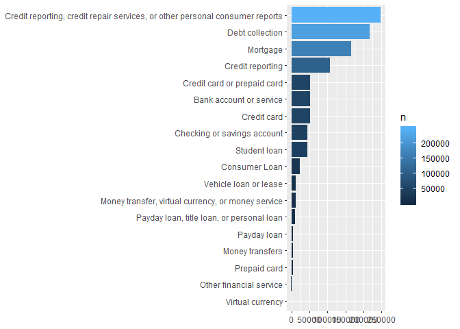
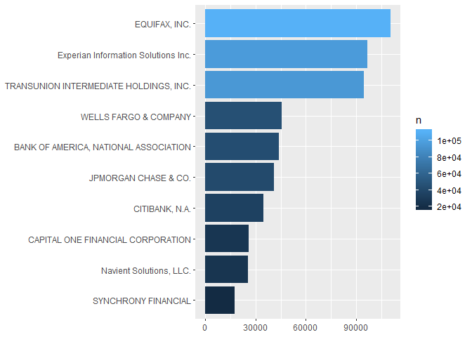

Introduction There is an ongoing issue with fraud and identity theft in
the United States. Everyday consumers are harassed by scammers who use
robocalls in order to collect unrightfully owed funds from these
consumers. Also consumers must fight against unfair business practices
which can be legal but border on the line of fraudulent activity. The
Consumer Complaint Database tracks various complaints from consumers for
mortgages, credit cards, auto loans, and student loans. By tracking
trends over time with this data, it should help warn us of potential
problems in a given market. This can help us prepare for the future to
eliminate or reduce these issues for consumers. With the Consumer
Complaint Database we can narrow down which company reports incorrectly
information on a consumers credit profile. The consumers of each company
are the clients. These clients are the ones affected by these debt
collection calls throughout the country. With us narrowing down which
companies are experiencing the most debt collection calls towards their
consumers, we can then determine effective ways to block or stop these
calls in the future. We are going to gather this data from the Consumer
Complaints Database that shows different complaints from different
companies and the type of issues each consumer has experienced.

Let us start off by declaring the libraries we would be using in our
analysis. tidyverse is a great package to have as it contains virtually
every tool that we would require for data wrangling.

Product - different type of Issue - Actual problem that occured Company
- different companies that consumers have complaints to State - States
the complaints came from Zip Code - Zip codes the complaints came from
Timely response - time manner company responded to consumer

The necessary libraries needed for the project has been installed and
are loaded here.

``` r
library(tidyverse) #The swiss knife!
library(caret)
library(rmarkdown)
library(lubridate)
library(tidyr)
```

All of the packages are loaded. Therefore, we load the data into R and
call the data frame dta.

``` r
getwd()
```

    ## [1] "C:/Users/travis.clark/Downloads"

``` r
dta <- read.csv("complaints.csv")
```

An extra variable was included in the data frame after the data was
read. Thus, the variable was removed.

``` r
dta <- select(dta, -c(X))
```

\#\#Exploratory Data Analysis Now that the data have been ingested it is
time to begin the exploration. The first thing to do is to have a quick
look at our data. For that, the `str()` function and the more
human-readable (and intuitive), `glimpse()` function. is used.

``` r
glimpse(dta)
```

    ## Observations: 1,048,575
    ## Variables: 18
    ## $ Date.received                <fct> 2019-07-06, 2019-07-06, 2019-07-0...
    ## $ Product                      <fct> "Debt collection", "Checking or s...
    ## $ Sub.product                  <fct> Medical debt, Checking account, I...
    ## $ Issue                        <fct> Attempts to collect debt not owed...
    ## $ Sub.issue                    <fct> Debt was result of identity theft...
    ## $ Consumer.complaint.narrative <lgl> NA, NA, NA, NA, NA, NA, NA, NA, N...
    ## $ Company.public.response      <fct> NA, NA, Company has responded to ...
    ## $ Company                      <fct> "OPTIMUM OUTCOMES, INC.", "ALLY F...
    ## $ State                        <fct> GA, MA, TX, PA, AZ, GA, FL, VA, M...
    ## $ ZIP.code                     <fct> 30096, NA, 794XX, 15213, 86301, 3...
    ## $ Tags                         <fct> NA, Servicemember, NA, NA, NA, NA...
    ## $ Consumer.consent.provided.   <fct> NA, NA, Consent not provided, NA,...
    ## $ Submitted.via                <fct> Web, Web, Web, Web, Postal mail, ...
    ## $ Date.sent.to.company         <fct> 2019-07-06, 2019-07-06, 2019-07-0...
    ## $ Company.response.to.consumer <fct> Closed with explanation, In progr...
    ## $ Timely.response.             <fct> Yes, Yes, Yes, Yes, Yes, Yes, Yes...
    ## $ Consumer.disputed.           <fct> N/A, N/A, N/A, N/A, N/A, N/A, N/A...
    ## $ Complaint.ID                 <dbl> 3297592, 3297754, 3297828, 329656...

As expected, there are 1,048,575 rows with 18 variables inside of the
data set. Most of the variables are self explanotary. We also notice
that there are two datevariables which are being read in as character
variables. We can easily convert these to date types using the functions
from lubridate package.Now let’s take a look of the structure of the
data set to see what additional information is available.

``` r
str(dta)
```

    ## 'data.frame':    1048575 obs. of  18 variables:
    ##  $ Date.received               : Factor w/ 1794 levels "2014-08-07","2014-08-08",..: 1794 1794 1794 1793 1793 1793 1793 1793 1793 1793 ...
    ##  $ Product                     : Factor w/ 18 levels "Bank account or service",..: 8 2 8 7 8 8 7 2 8 2 ...
    ##  $ Sub.product                 : Factor w/ 76 levels "(CD) Certificate of deposit",..: 41 8 34 16 34 34 16 65 46 8 ...
    ##  $ Issue                       : Factor w/ 164 levels "Account opening, closing, or management",..: 15 88 15 114 58 15 75 32 146 88 ...
    ##  $ Sub.issue                   : Factor w/ 218 levels "Account information incorrect",..: 62 66 57 191 10 57 1 20 181 66 ...
    ##  $ Consumer.complaint.narrative: logi  NA NA NA NA NA NA ...
    ##  $ Company.public.response     : Factor w/ 10 levels "Company believes complaint caused principally by actions of third party outside the control or direction of the company",..: NA NA 10 NA NA 9 5 NA NA NA ...
    ##  $ Company                     : Factor w/ 5188 levels " Lippman Recupero, LLC",..: 3554 280 1109 280 1520 4642 1708 3357 3132 3357 ...
    ##  $ State                       : Factor w/ 63 levels "AA","AE","AK",..: 16 26 54 47 8 16 14 57 32 27 ...
    ##  $ ZIP.code                    : Factor w/ 20914 levels "-2914","(1352",..: 5105 NA 15857 1447 17239 5109 6590 NA 12539 2930 ...
    ##  $ Tags                        : Factor w/ 3 levels "Older American",..: NA 3 NA NA NA NA NA 1 NA NA ...
    ##  $ Consumer.consent.provided.  : Factor w/ 5 levels "Consent not provided",..: NA NA 1 NA 4 NA 1 NA NA 4 ...
    ##  $ Submitted.via               : Factor w/ 6 levels "Email","Fax",..: 6 6 6 6 4 6 6 6 6 5 ...
    ##  $ Date.sent.to.company        : Factor w/ 1794 levels "2014-08-07","2014-08-08",..: 1794 1794 1794 1793 1793 1793 1793 1793 1793 1793 ...
    ##  $ Company.response.to.consumer: Factor w/ 6 levels "Closed","Closed with explanation",..: 2 5 2 5 2 4 2 5 2 5 ...
    ##  $ Timely.response.            : Factor w/ 2 levels "No","Yes": 2 2 2 2 2 2 2 2 2 2 ...
    ##  $ Consumer.disputed.          : Factor w/ 3 levels "N/A","No","Yes": 1 1 1 1 1 1 1 1 1 1 ...
    ##  $ Complaint.ID                : num  3297592 3297754 3297828 3296569 3297110 ...

Evaluating the output for each code, it is easy to determine that the
codes provide almost identical information.

\#\#Plots The code below shows a frequency distribution and histogram
for the number of complaints each product has.

``` r
library(tidyverse)
(Products <- dta %>% count(Product) %>% arrange(desc(n)))
```

    ## # A tibble: 18 x 2
    ##    Product                                                                n
    ##    <fct>                                                              <int>
    ##  1 Credit reporting, credit repair services, or other personal cons~ 247721
    ##  2 Debt collection                                                   216620
    ##  3 Mortgage                                                          165833
    ##  4 Credit reporting                                                  106091
    ##  5 Credit card or prepaid card                                        51720
    ##  6 Bank account or service                                            51519
    ##  7 Credit card                                                        50896
    ##  8 Checking or savings account                                        44364
    ##  9 Student loan                                                       44247
    ## 10 Consumer Loan                                                      23754
    ## 11 Vehicle loan or lease                                              12242
    ## 12 Money transfer, virtual currency, or money service                 10993
    ## 13 Payday loan, title loan, or personal loan                           9273
    ## 14 Payday loan                                                         4403
    ## 15 Money transfers                                                     4065
    ## 16 Prepaid card                                                        3774
    ## 17 Other financial service                                             1042
    ## 18 Virtual currency                                                      18

``` r
ggplot(Products, aes(x = reorder(Product,n), y =n, fill = n)) +
  geom_bar(stat = 'identity') +
  coord_flip() +
  labs(x = NULL, y = NULL)
```



It is quite evident that credit reporting, debt collection and mortgage
are the major areas where consumers are not very happy. Also we can
easily see that virtual currency, other financial service, and prepaid
card has the least amount of complaints.

The code below shows a frequency distribution and histogram for the
number of complaints each company has.

``` r
companies <- dta %>% count(Company) %>% arrange(desc(n)) %>%
  top_n(10)
```

    ## Selecting by n

``` r
ggplot(companies, aes(x = reorder(Company, n), y = n, fill = n)) +
geom_bar(stat = 'identity') +
coord_flip() +
labs(x = NULL, y = NULL)
```



As we can see EQUIFAX INC., Experian Information Solutions Inc., and
TRANSUNION INTERMEDIATE HOLDINGS, INC. are the ones that see the maximum
number of complaints. Now I want to focus on just the states of Georgia,
Texas, California and Florida.

\#\#Data Wrangligling

The data set was provided in a nearly cleaned manner. However, multiple
data wrangling techniques were performed on the data frame to transom it
into a document that can be analyzed. These techniques include removing
unnecessary variables, changing the names of some columns, adding
variables, and including functions for calculation.

With the Consumer Complaints Dataset there was a lot of data that I had
to analyze. This dataset included different complaints of fraud such as
debt collection, mortgage, credit reporting, and student loans just to
name a few. I have analyzed the dataset and wanted to narrow down to
only credit reporting and debt collection issues. In order to narrow
down my data to figure out which of the top companies are experiencing
the most complaints in Georgia, Florida, Texas, and California are
experiencing the most credit reporting and debt collection complaints I
had to do some data wrangling in R, which included organizing my data
points, as well as cleaning the data by removing empty or extra data
points in the dataset. This will allow me to cut out all the other
entire complaints inside the dataset and narrow down to specifically the
states we chose to cover to help me determine which of top companies are
experiencing the most complaints.

With this new clean dataset I have filtered out the product, state,
company, submitted via, month and timely response variables.

``` r
df_ml <- dta %>% filter(
  State %in% c('CA', 'FL', 'TX', 'GA'),
  Company %in% c('WELLS FARGO & COMPANY', 'EQUIFAX, INC.','BANK OF AMERICA, NATIONAL ASSOCIATION')
) %>% mutate(Month = month(`Date.sent.to.company`,label = TRUE)) %>% 
  select(Product, Company, State, Month, Timely.response.)
```

Now I need to change the name of my Timely response variable and change
the yes and no to 1 and 0.

``` r
df_ml$Timely_respone<- ifelse(df_ml$Timely.response. == "Timely.response.",1,0)
```

``` r
validation_index <- createDataPartition(df_ml$Product, p=0.80, list=FALSE)
```

    ## Warning in createDataPartition(df_ml$Product, p = 0.8, list = FALSE): Some
    ## classes have no records ( Virtual currency ) and these will be ignored

``` r
validation <- df_ml[-validation_index,]
# use the remaining 80% of data to training and testing the models
df_ml <- df_ml[validation_index,]
```

Now I can start my machine learning with my dependent variable being
Timely response.

\#\#Machine Learning - Logistic Regression Logistic regression measures
the relationship between a categorical dependent variable that is
binary. The dependent variable is timely response, and 1 is the label
for yes and 0 for no. Logistic regression was the best model for this
research because of the binary dependent variable. The independent
variables used in the model are categorical. The model is built to
predict if a customer feels that their complaint was handled promptly.
The independent variables are company, state, month, and product. Two
models were developed to predicted timely response. The first model was
hard to interpret because of the number of attributes list in the
categorical variables. The second model in gave better results.

``` r
model2 = glm(Timely_respone ~ State + Company + Month + Product, data=df_ml, family=binomial)
```

    ## Warning: glm.fit: algorithm did not converge

``` r
summary(model2)
```

    ## 
    ## Call:
    ## glm(formula = Timely_respone ~ State + Company + Month + Product, 
    ##     family = binomial, data = df_ml)
    ## 
    ## Deviance Residuals: 
    ##        Min          1Q      Median          3Q         Max  
    ## -2.409e-06  -2.409e-06  -2.409e-06  -2.409e-06  -2.409e-06  
    ## 
    ## Coefficients:
    ##                                                                                       Estimate
    ## (Intercept)                                                                         -2.657e+01
    ## StateFL                                                                             -7.879e-13
    ## StateGA                                                                             -6.720e-13
    ## StateTX                                                                             -6.529e-13
    ## CompanyEQUIFAX, INC.                                                                -7.061e-13
    ## CompanyWELLS FARGO & COMPANY                                                        -1.521e-12
    ## Month.L                                                                             -1.937e-13
    ## Month.Q                                                                             -1.117e-12
    ## Month.C                                                                              3.775e-13
    ## Month^4                                                                              1.035e-12
    ## Month^5                                                                             -5.532e-13
    ## Month^6                                                                             -9.878e-13
    ## Month^7                                                                              7.826e-13
    ## Month^8                                                                              8.734e-13
    ## Month^9                                                                             -1.088e-12
    ## Month^10                                                                            -7.783e-13
    ## Month^11                                                                             1.772e-12
    ## ProductChecking or savings account                                                  -2.676e-13
    ## ProductConsumer Loan                                                                 4.880e-13
    ## ProductCredit card                                                                  -1.841e-13
    ## ProductCredit card or prepaid card                                                  -3.244e-13
    ## ProductCredit reporting                                                              5.939e-14
    ## ProductCredit reporting, credit repair services, or other personal consumer reports -5.660e-14
    ## ProductDebt collection                                                              -8.210e-14
    ## ProductMoney transfer, virtual currency, or money service                           -2.317e-13
    ## ProductMoney transfers                                                               1.019e-13
    ## ProductMortgage                                                                      1.810e-12
    ## ProductOther financial service                                                       1.478e-13
    ## ProductPayday loan                                                                  -8.484e-14
    ## ProductPayday loan, title loan, or personal loan                                     2.331e-13
    ## ProductPrepaid card                                                                 -2.473e-13
    ## ProductStudent loan                                                                  5.829e-13
    ## ProductVehicle loan or lease                                                         3.630e-13
    ##                                                                                     Std. Error
    ## (Intercept)                                                                          5.495e+03
    ## StateFL                                                                              3.555e+03
    ## StateGA                                                                              4.276e+03
    ## StateTX                                                                              3.865e+03
    ## CompanyEQUIFAX, INC.                                                                 8.723e+03
    ## CompanyWELLS FARGO & COMPANY                                                         4.272e+03
    ## Month.L                                                                              4.967e+03
    ## Month.Q                                                                              5.038e+03
    ## Month.C                                                                              4.838e+03
    ## Month^4                                                                              4.952e+03
    ## Month^5                                                                              4.917e+03
    ## Month^6                                                                              4.864e+03
    ## Month^7                                                                              4.864e+03
    ## Month^8                                                                              4.780e+03
    ## Month^9                                                                              4.670e+03
    ## Month^10                                                                             4.680e+03
    ## Month^11                                                                             4.914e+03
    ## ProductChecking or savings account                                                   7.283e+03
    ## ProductConsumer Loan                                                                 1.571e+04
    ## ProductCredit card                                                                   9.356e+03
    ## ProductCredit card or prepaid card                                                   9.511e+03
    ## ProductCredit reporting                                                              1.021e+04
    ## ProductCredit reporting, credit repair services, or other personal consumer reports  9.657e+03
    ## ProductDebt collection                                                               9.684e+03
    ## ProductMoney transfer, virtual currency, or money service                            1.727e+04
    ## ProductMoney transfers                                                               3.301e+04
    ## ProductMortgage                                                                      5.945e+03
    ## ProductOther financial service                                                       6.521e+04
    ## ProductPayday loan                                                                   1.029e+05
    ## ProductPayday loan, title loan, or personal loan                                     3.032e+04
    ## ProductPrepaid card                                                                  6.520e+04
    ## ProductStudent loan                                                                  2.188e+04
    ## ProductVehicle loan or lease                                                         2.319e+04
    ##                                                                                     z value
    ## (Intercept)                                                                          -0.005
    ## StateFL                                                                               0.000
    ## StateGA                                                                               0.000
    ## StateTX                                                                               0.000
    ## CompanyEQUIFAX, INC.                                                                  0.000
    ## CompanyWELLS FARGO & COMPANY                                                          0.000
    ## Month.L                                                                               0.000
    ## Month.Q                                                                               0.000
    ## Month.C                                                                               0.000
    ## Month^4                                                                               0.000
    ## Month^5                                                                               0.000
    ## Month^6                                                                               0.000
    ## Month^7                                                                               0.000
    ## Month^8                                                                               0.000
    ## Month^9                                                                               0.000
    ## Month^10                                                                              0.000
    ## Month^11                                                                              0.000
    ## ProductChecking or savings account                                                    0.000
    ## ProductConsumer Loan                                                                  0.000
    ## ProductCredit card                                                                    0.000
    ## ProductCredit card or prepaid card                                                    0.000
    ## ProductCredit reporting                                                               0.000
    ## ProductCredit reporting, credit repair services, or other personal consumer reports   0.000
    ## ProductDebt collection                                                                0.000
    ## ProductMoney transfer, virtual currency, or money service                             0.000
    ## ProductMoney transfers                                                                0.000
    ## ProductMortgage                                                                       0.000
    ## ProductOther financial service                                                        0.000
    ## ProductPayday loan                                                                    0.000
    ## ProductPayday loan, title loan, or personal loan                                      0.000
    ## ProductPrepaid card                                                                   0.000
    ## ProductStudent loan                                                                   0.000
    ## ProductVehicle loan or lease                                                          0.000
    ##                                                                                     Pr(>|z|)
    ## (Intercept)                                                                            0.996
    ## StateFL                                                                                1.000
    ## StateGA                                                                                1.000
    ## StateTX                                                                                1.000
    ## CompanyEQUIFAX, INC.                                                                   1.000
    ## CompanyWELLS FARGO & COMPANY                                                           1.000
    ## Month.L                                                                                1.000
    ## Month.Q                                                                                1.000
    ## Month.C                                                                                1.000
    ## Month^4                                                                                1.000
    ## Month^5                                                                                1.000
    ## Month^6                                                                                1.000
    ## Month^7                                                                                1.000
    ## Month^8                                                                                1.000
    ## Month^9                                                                                1.000
    ## Month^10                                                                               1.000
    ## Month^11                                                                               1.000
    ## ProductChecking or savings account                                                     1.000
    ## ProductConsumer Loan                                                                   1.000
    ## ProductCredit card                                                                     1.000
    ## ProductCredit card or prepaid card                                                     1.000
    ## ProductCredit reporting                                                                1.000
    ## ProductCredit reporting, credit repair services, or other personal consumer reports    1.000
    ## ProductDebt collection                                                                 1.000
    ## ProductMoney transfer, virtual currency, or money service                              1.000
    ## ProductMoney transfers                                                                 1.000
    ## ProductMortgage                                                                        1.000
    ## ProductOther financial service                                                         1.000
    ## ProductPayday loan                                                                     1.000
    ## ProductPayday loan, title loan, or personal loan                                       1.000
    ## ProductPrepaid card                                                                    1.000
    ## ProductStudent loan                                                                    1.000
    ## ProductVehicle loan or lease                                                           1.000
    ## 
    ## (Dispersion parameter for binomial family taken to be 1)
    ## 
    ##     Null deviance: 0.0000e+00  on 65736  degrees of freedom
    ## Residual deviance: 3.8138e-07  on 65704  degrees of freedom
    ## AIC: 66
    ## 
    ## Number of Fisher Scoring iterations: 25

This model was producing more independent variables then I wanted. For
example Month has 12 months and a independent variable was produced for
all of them.

``` r
model4 = glm(Timely_respone ~ Company + State, data=df_ml, family=binomial)
```

    ## Warning: glm.fit: algorithm did not converge

``` r
summary(model4)
```

    ## 
    ## Call:
    ## glm(formula = Timely_respone ~ Company + State, family = binomial, 
    ##     data = df_ml)
    ## 
    ## Deviance Residuals: 
    ##        Min          1Q      Median          3Q         Max  
    ## -2.409e-06  -2.409e-06  -2.409e-06  -2.409e-06  -2.409e-06  
    ## 
    ## Coefficients:
    ##                                Estimate Std. Error z value Pr(>|z|)
    ## (Intercept)                  -2.657e+01  3.375e+03  -0.008    0.994
    ## CompanyEQUIFAX, INC.         -2.305e-12  3.538e+03   0.000    1.000
    ## CompanyWELLS FARGO & COMPANY -2.529e-12  4.198e+03   0.000    1.000
    ## StateFL                      -1.435e-12  3.546e+03   0.000    1.000
    ## StateGA                      -1.288e-12  4.268e+03   0.000    1.000
    ## StateTX                      -1.310e-12  3.850e+03   0.000    1.000
    ## 
    ## (Dispersion parameter for binomial family taken to be 1)
    ## 
    ##     Null deviance: 0.0000e+00  on 65736  degrees of freedom
    ## Residual deviance: 3.8138e-07  on 65731  degrees of freedom
    ## AIC: 12
    ## 
    ## Number of Fisher Scoring iterations: 25

Machine Learning Model
*y* = 2.274*e* − 13*x*<sub>1</sub> − 2.528*e* − 12*x*<sub>2</sub> −  − 1.354*e* − 12*x*<sub>3</sub> +  − 1.317*e* − 12*x*<sub>4</sub> − 1.315*e* − 12
\#\#The Results The company with the highest number of complaints is
Equifax, followed by Experian, then Transunion. It was not a shock that
Wells Fargo came in at number four given their latest detrimental media
debacle.

The model predicts the dependent variable, whether or not the consumer
feels that there was a timely response to their complaint. The p-values
show that the variables are not significant for predicting timely
response. Residual deviance is related to our model because there are
three independent variables. This metric indicates how plausible it is
that we will see if the model has the independent variables that are in
the model. The high level of degrees of freedom suggests that the data
does not plausibly emanate from a logistic regression model that
includes the independent variables selected. An evaluation of the model
residuals explains that the model has room to achieve more significant
results.

\#\#Future Work In the future, we plan on building a better model and
reducing the scope to include information regarding only college
students. Natural language processing is a machine learning technique
that analyzes text to determine the feelings and emotions of the
consumer. We plan to expand the research to classify the sentiment of
the consumer through their issues and sub-issues.
